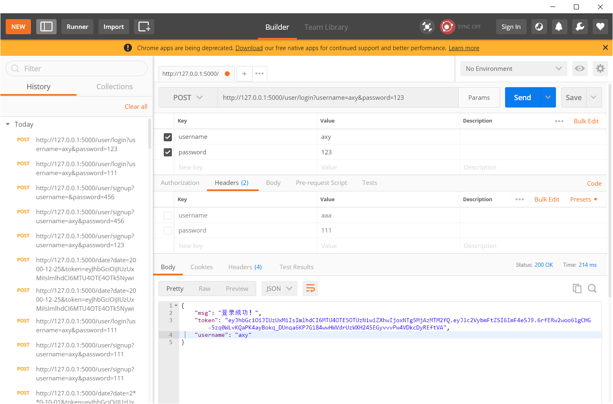
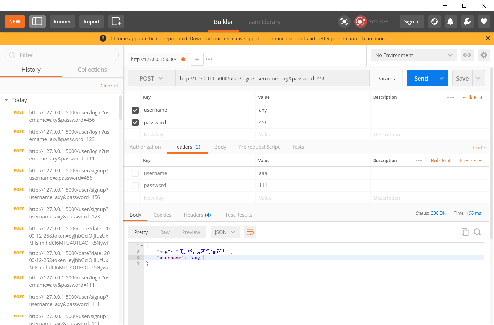
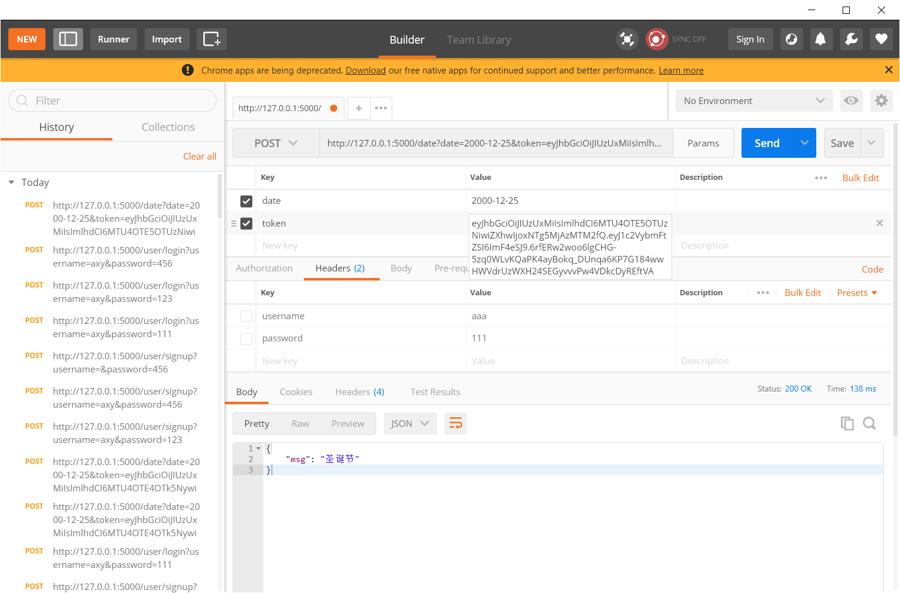
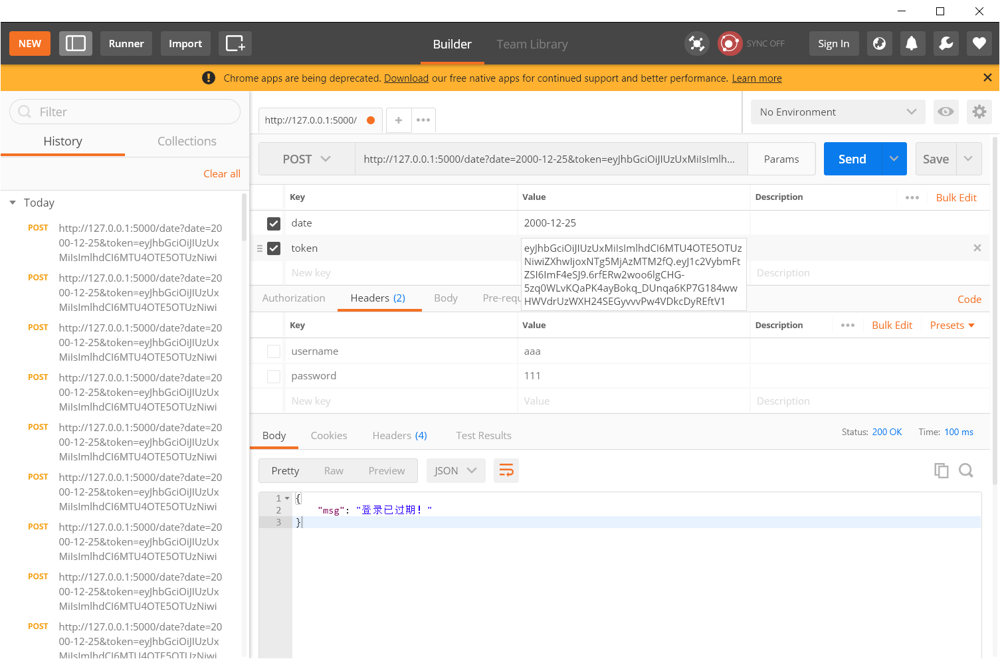
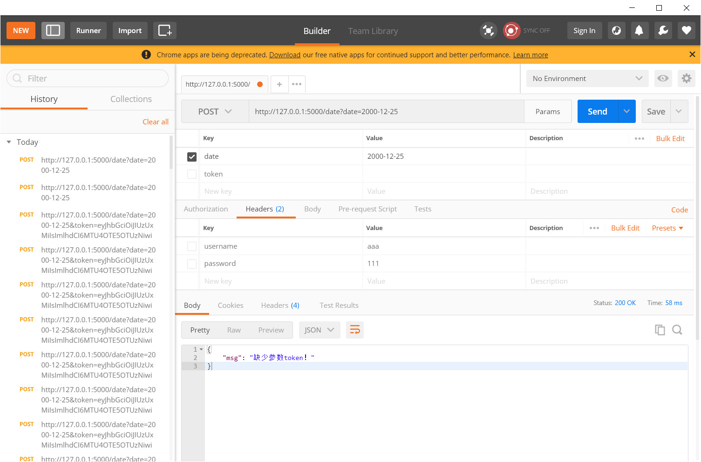
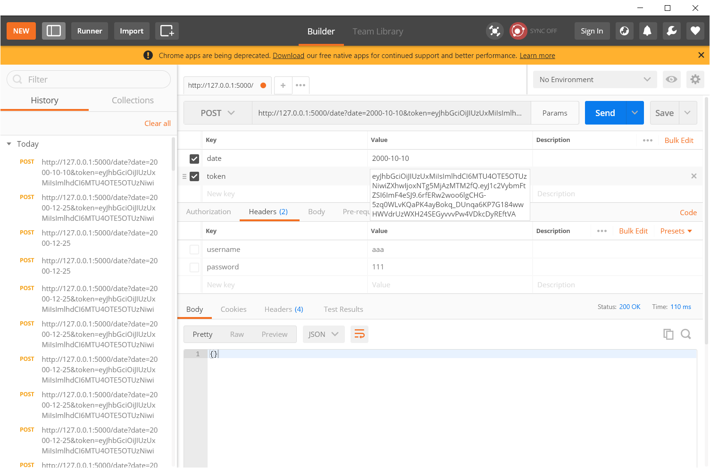

# 接口文档

## 1. 注册接口（signup）

* 方法：POST

* URL：<http://127.0.0.1:5000/user/signup/>

* 参数：

  | 参数名   | 类型   | 内容                                           |
  | -------- | ------ | ---------------------------------------------- |
  | username | 字符串 | 要注册的用户名（必填，同一用户名不可重复注册） |
  | password | 字符串 | 要注册用户的密码（必填）                       |

* 返回：

  | 参数名   | 类型   | 内容               |
  | -------- | ------ | ------------------ |
  | msg      | 字符串 | 注册结果的提示信息 |
  | username | 字符串 | 注册时填写的用户名 |
  | password | 字符串 | 注册时填写的密码   |

* 示例：

第1次注册用户名axy

第2次注册用户名axy

不输入用户名注册

---

## 2. 登陆接口（login）

* 方法：POST

* URL：<http://127.0.0.1:5000/user/login/>

* 参数：

  | 参数名   | 类型   | 内容                     |
  | -------- | ------ | ------------------------ |
  | username | 字符串 | 要登陆的用户名（必填）   |
  | password | 字符串 | 要登陆用户的密码（必填） |

* 返回：

  | 参数名   | 类型   | 内容                                      |
  | -------- | ------ | ----------------------------------------- |
  | msg      | 字符串 | 登陆结果的提示信息                        |
  | username | 字符串 | 登陆时填写的用户名                        |
  | token    | 字符串 | 登陆成功时生成的token（登陆失败时不返回） |

* 示例：

用正确的密码登陆axy

用错误的密码登陆axy

---

## 3. 日期查询接口（date）

* 方法：POST

* URL：<http://127.0.0.1:5000/date/>

* 参数：

  | 参数名   | 类型   | 内容                     |
  | -------- | ------ | ------------------------ |
  | token | 字符串 | 登陆成功时返回的token（必填） |
  | date | 字符串 | 要查询的日期（必填，格式如2000-04-05） |

* 返回：

  | 参数名 | 类型   | 内容                                                         |
  | ------ | ------ | ------------------------------------------------------------ |
  | msg    | 字符串 | 查询结果（节日名或者提示信息）（传入的日期查不到节日时不返回） |
  
* 示例：

传入前面登陆axy时的token用于查询2017-12-25

传入错误的token（修改了前面token的最后一位）用于查询2017-12-25

不传入token直接查询2017-12-25

传入前面登陆axy时的token用于查询2017-10-10

